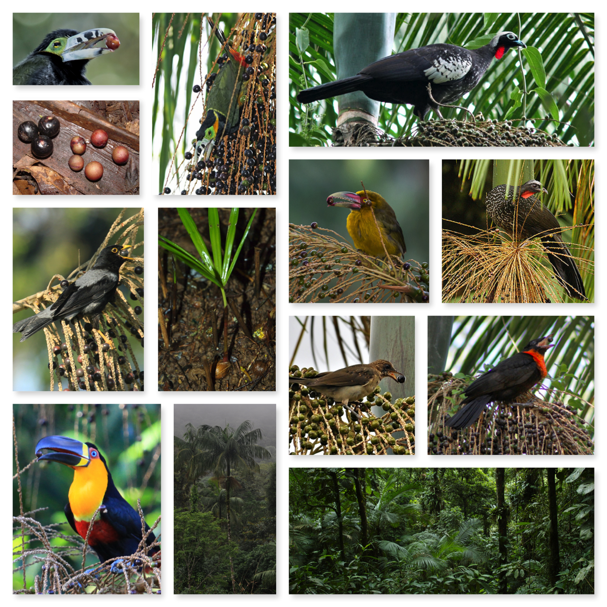

# Euterpe
Here we have a series of examples how to teach ecology using data from _Euterpe edulis_ (Aracaceae), a dominant keystone palm from the Atlantic tropical and subtropical forests of South America.

This material accompanies:
Galetti, M., Guevara, R., Côrtes, M. C., Fadini, R., Sandro Von Matter, Abraão B. Leite, Fábio Labecca, Thiago Ribeiro, Carolina S. Carvalho, Rosane G. Collevatti, Mathias M. Pires, Paulo R. Guimarães Jr., Pedro H. Brancalion, Milton C. Ribeiro and Pedro Jordano. (2013). Functional extinction of birds drives rapid evolutionary changes in seed size. **Science**, 340(May), 1086–1091. http://doi.org/10.1126/science.1233774

as well as other studies from [LaBic](http://labic.eco.br) focusing on _Euterpe edulis_.

---------

The data and codes were organized by:

Mauro Galetti - São Paulo State University (UNESP), Rio Claro, SP, Brazil.    
Pedro Jordano - Estación Biolófgica de Doñana (EBD-CSIC), Sevilla, Spain.        
Marina Côrrea Cortês - São Paulo State University (UNESP), Rio Claro, SP, Brazil.       
Milton Cezar Ribeiro - São Paulo State University (UNESP), Rio Claro, SP, Brazil.      
Carolina Carvalho - São Paulo State University (UNESP), Rio Claro, SP, Brazil.     
Débora Rother - Laboratório de Ecologia e Restauração Florestal, Esalq/USP - Piracicaba, SP, Brazil.     
Marco Aurélio Pizo - São Paulo State University (UNESP), Rio Claro, SP, Brazil.    
Mathias M. Pires - Campinas State University (UNICAMP), Campinas, SP, Brazil.       
Pedro Brancalion - Laboratório de Ecologia e Restauração Florestal, Esalq/USP - Piracicaba, SP, Brazil.         
